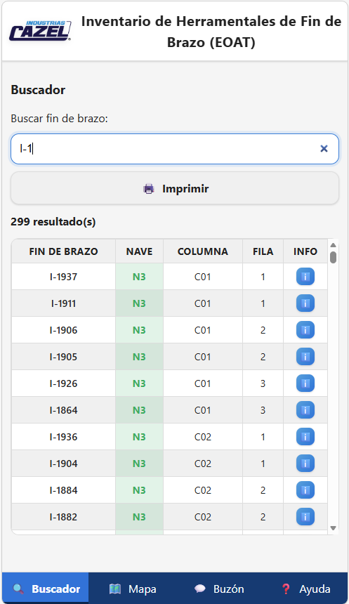

# Proyecto: Página Web para Inventario de Herramental de Fin de Brazo (EOAT)

## Estado del proyecto

Proyecto piloto en fase de pruebas internas.

## Descripción

Sistema web estático diseñado para facilitar la localización de herramental de fin de brazo (EOAT) dentro de los almacenes de Industrias Cazel.

# Vista general

## Objetivo:
- Reducir el tiempo de búsqueda y acomodo de los fines de brazo en el almacén
- Reducir errores en la ubicación de los fines de brazo
- Mejorar la eficiencia en cambios de fin de brazo (SMED)

## Funciones principales de la página web:
- Buscar fin de brazo y mostrar
    - Número de fin de brazo
    - Nave
    - Columna
    - Fila
    - Foto (WIP)
- Mostrar un mapa o diagrama del acomodo de los racks en el almacén
    - Nave 1
    - Nave 2 y 3
- Imprimir o descargar como PDF información pertinente
- Buzon digital
    - Quejas
    - Sugerencias
    - EOAT no registrado

## La página funciona en:

- Teléfonos móviles
- Tablets
- Computadoras

Solo requiere un navegador moderno y acceso a internet:
- Google Chrome
- Microsoft Edge
- Mozilla Firefox
- Safari

## Código QR

# Arquitectura del proyecto:

    EOAT Project
    │
    ├── index.html
    ├── main.js
    ├── styles.css
    ├── print.css
    │
    ├── assets/
    │   ├── EOAT/
    │   │   ├── no-image.svg
    │   │   └── *Imágenes de los EOAT*
    │   ├── SFX/
    │   │   ├── error.mp3
    │   │   └── popup.mp3
    │   ├── LogoCazel.webp
    │   ├── MainIcon.svg
    │   ├── MapaAlmacenN1.jpeg
    │   └── MapaAlmacenN23.jpeg
    │
    └── data/
        ├── EOAT_data.xlsx
        ├── json_converter.py
        ├── eoat_data.csv
        └── eoat_data.json

## El proyecto fue desarrollado como una pagina web estática utilizando:

- **HTML**
- **CSS**
- **JavaScript**
- **JSON**
- **Python**
- **GitHub Pages** (hosting)
- **AI Chatbots**

No requiere frameworks ni backend.

# Actualización de Base de Datos:
## Usando el script de python
- Simplemente se ejecuta el script "json_converter.py" dentro del folder "data", tomando como base el archivo de Excel "EOAT_data.xlsx". Automaticamente se crea la base de datos JSON con la siguiente estructura:
### Estructura eoat_data.json
    {
        "id": "I-1937",
        "estado": "EOAT",
        "nave": 3,
        "columna": "C01",
        "fila": "1",
        "imagen": "I-1937.jpeg"
    },

## Alternativa: 
- Subir el archivo .csv a Copilot o ChatGPT y escribir el siguiente prompt: **"Convierte la tabla csv a una base de datos json. Asegurate que los espacios vacios en la columna "Imagen" tenga valores de null, y los espacios vacíos en las demas columnas sean texto vacio (""). "**

# Links y recursos:
## AI Chatbots 
- https://chatgpt.com/
- https://copilot.microsoft.com/
## Github Repo
- https://github.com/ProcesosCazel/Inventario
## Github Pages
- https://procesoscazel.github.io/Inventario/
## Descargar Python
- https://www.python.org/downloads/
### Dependencias necesarias:
- pandas
- openpyxl
#### Para instalarlas copia y pega el codigo en la terminal de la computadora:
    pip install pandas openpyxl

# Propuestas de mejora futuras
- Historial de movimientos (entradas y salidas de EOAT)
- Registro de mantenimientos preventivos y correctivos
- Estadísticas de uso y KPI's
- Applicacion offline (PWA)

# Autores:
## 1. Ing. Hector Uriel Ramirez Sandoval
### Auxiliar de robot | Industrias Cazel
**uramirez@cazel.mx**
--
## 2. Ing. José Antonio Guzmán Trujillo
### Becario de Procesos | Industrias Cazel
**tecnicosprocesos@cazel.mx**
--

**Este proyecto fue desarrollado para uso interno de Industrias Cazel como herramienta de apoyo para ingenieros, técnicos y personal de procesos. Puede contener información confidencial.**

**Copyright 2026 Industrias Cazel.**
