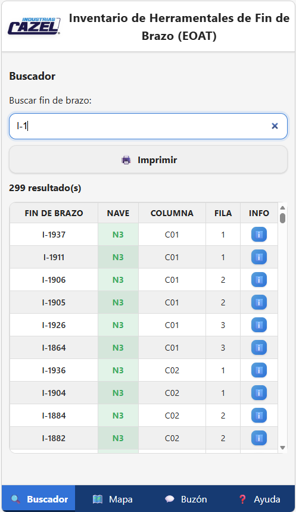

# Inventario Digital EOAT - Release 2.0

Sistema web estático para localizar Herramentales de Fin de Brazo (EOAT) dentro de los almacenes de Industrias Cazel.

**Versión:** Release 2.0  
**Fecha:** 2026-09-28

## Funciones principales

- Buscar EOAT por número e identificar nave, columna y fila.
- Mostrar estado y fotografía del herramental.
- Consultar mapas de almacenes de Nave 1 y Nave 2/3.
- Imprimir información del resultado.
- Enviar reportes o sugerencias desde el Buzón.
- Consultar la sección de Ayuda.
- Actualizar la base desde `admin.html` usando el Excel maestro `EOAT_data.xlsx`.



## Actualización de la base de datos

La actualización ya no requiere CSV, Python ni PowerShell.

Flujo actual:

1. Editar el archivo maestro `EOAT_data.xlsx`.
2. Abrir el Inventario EOAT.
3. Entrar a **Ayuda**.
4. Seleccionar **Actualizar la base de datos**.
5. Cargar `EOAT_data.xlsx`.
6. Presionar **Convertir y validar**.
7. Revisar registros nuevos, modificados y eliminados.
8. Descargar `eoat_data.json`.
9. Sobrescribir manualmente `data/eoat_data.json` en la copia local o en GitHub.

### Reglas de conversión

- `imagen` vacía -> `null`.
- Cualquier otra celda vacía -> `""`.
- `fila` siempre se genera como texto.
- El JSON conserva exactamente los campos:

```json
{
    "id": "I-1937",
    "estado": "3 dedos, 2 pinzas",
    "nave": 3,
    "columna": "C01",
    "fila": "1",
    "imagen": "I-1937.jpeg"
}
```

## Arquitectura principal

```text
Inventario_EOAT_Release_2.0/
├── index.html
├── main.js
├── styles.css
├── print.css
├── manifest.webmanifest
├── admin.html
├── admin.css
├── admin.js
├── eoat-converter.js
├── eoat-validator.js
├── eoat-xlsx-reader.js
├── VERSION
├── RELEASE_NOTES.md
├── assets/
│   ├── EOAT/
│   ├── SFX/
│   ├── README/
│   ├── vendor/
│   ├── LogoCazel.webp
│   ├── MainIcon.ico
│   ├── MainIcon-192.png
│   ├── MainIcon-512.png
│   ├── MapaAlmacenN1.jpeg
│   └── MapaAlmacenN23.jpeg
├── data/
│   ├── EOAT_data.xlsx
│   └── eoat_data.json
└── QR code/
    ├── Codigo QR.docx
    ├── qr-code.png
    └── qr-code.svg
```

## Tecnologías

- HTML
- CSS
- JavaScript
- JSON
- Microsoft Excel (`.xlsx`)
- JSZip local para lectura del archivo XLSX
- GitHub Pages para publicación

No requiere backend, Python ni instalación de dependencias en la computadora del usuario.


## Compatibilidad

Compatible con navegadores modernos en:

- Computadoras
- Tablets
- Teléfonos móviles

## Código QR


## Publicación

- Repositorio: https://github.com/ProcesosCazel/Inventario
- GitHub Pages: https://procesoscazel.github.io/Inventario/

## Autores

**Ing. Hector Uriel Ramirez Sandoval**  
Auxiliar de robot | Industrias Cazel

**Ing. José Antonio Guzmán Trujillo**  
Becario de Procesos | Industrias Cazel

Este proyecto fue desarrollado para uso interno de Industrias Cazel como herramienta de apoyo para ingenieros, técnicos y personal de procesos.

Copyright 2026 Industrias Cazel.
